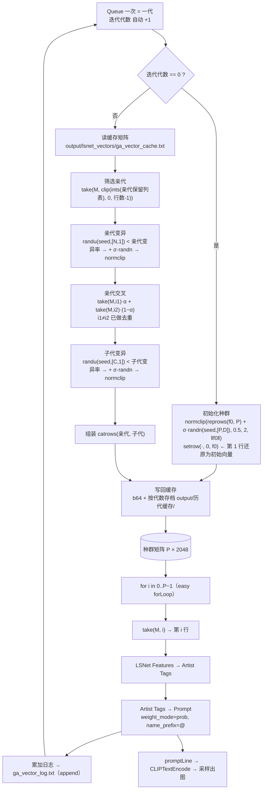

# Computational LSNet

**把 LSNet / Kaloscope 的「画师风格张量」从只能看，变成能算、能存、能读回、能进化。**

一个给 [**comfyui-lsnet**](https://github.com/spawner1145/comfyui-lsnet)（LSNet 画师分类器）用的
**附属节点包**：不改插件、不改权重、不重新训练，只加一层"计算层"——
直接把分类头的前特征向量（"画风张量"）反推成画师串、把画师串变回向量、用表达式做向量运算、
逐比特存档读回，并附带一套可以跑起来的**画师串遗传算法工作流**。

> **English TL;DR** — An *add-on node pack* for
> [comfyui-lsnet](https://github.com/spawner1145/comfyui-lsnet) (Kaloscope). It turns the LSNet
> artist-style feature vector into a first-class citizen: classify a style vector back into artist
> tags without an image, turn tags back into a vector, do arbitrary vector math on it
> (expression evaluator with 106 functions), round-trip it losslessly to txt (base64),
> and evolve it with a ready-made genetic-algorithm workflow.
> **Zero intrusion**: no plugin patch, no weight change, no retraining; the only dependency is `torch`.
> See [Credits](#credits--attribution) — this pack is an affiliate of `comfyui-lsnet`, its math node is
> inspired by [`more_math`](https://github.com/mcDandy/more_math.git), and the code was written by
> Hermes Agent / DeepSeek V4.1 Flash under the author's direction.


---

## 目录

- [它解决什么问题](#它解决什么问题)
- [节点一览](#节点一览)
- [安装与依赖](#安装与依赖)
- [三种常用配方](#三种常用配方)
- [节点参考](#节点参考)
  - [1. LSNet Features → Artist Tags](#1-lsnet-features--artist-tags)
  - [2. LSNet Artist Tags → Features](#2-lsnet-artist-tags--features)
  - [3. Vector Math](#3-vector-math)
  - [4. Vector → Text / txt](#4-vector--text--txt)
  - [5. Text / txt → Vector](#5-text--txt--vector)
  - [6. Artist Tags → Prompt](#6-artist-tags--prompt)
  - [7. Text Join](#7-text-join)
- [表达式语言（Vector Math）](#表达式语言vector-math)
- [三个必须知道的尺度事实](#三个必须知道的尺度事实)
- [配套工作流：画师串反推优化 GA v3.2](#配套工作流画师串反推优化-ga-v32)
- [实测数据](#实测数据)
- [已知限制 / FAQ](#已知限制--faq)
- [仓库结构 / 开发](#仓库结构--开发)
- [Credits & Attribution](#credits--attribution)

---

## 它解决什么问题

LSNet（Kaloscope 2.0 = `lsnet_xl_artist_448`，**39261** 个画师类）的前向是：

```
图像 448² ─ blocks+pool → 768 ─ projection: BN_Linear(768→2048) + ReLU → f (2048)
                                                                          │
                                    head: BN_Linear(2048→39261) → logits ─┘
                                              ↑ 本包所有"画风张量"就是这个 f
                                              ↑ 反推 = 对 head(f) 排序
```

原插件的节点只暴露了两件事：**图像 → 画师串** 和 **图像 → 特征张量**。于是你能看到 `f`，但
**算不了、存不了、读不回、改不了**：忘了哪张图、想混合两种画风、想按 `‖f‖`/余弦做筛选、想把优秀
的 `f` 存下来反复用——都做不到。

本包补上这一层，全部基于两个事实：

1. `head` 是**独立子模块**，输入就是 `f`。所以 `head(f)` 与"图像→分类"逐比特等价（实测误差 `0.00e+00`），
   而且 `f` 是可逆的过程入口。
2. `head = BN(2048) + Linear(2048→C)` 在 `eval` 下是**仿射**映射。所以 `head(mean(f)) == mean(head(f))`，
   多图/多向量取平均再反推是**严格合法**的"logit 空间集成"。

于是就有了：**不用图像也能反推画师串、画师串能变回向量、向量能用表达式算、能逐比特存和读、能当基因进化。**

---

## 节点一览

安装后出现在 ComfyUI 分类 **`Computational LSNet`**。

| # | 节点 | 一句话 |
|---|---|---|
| 1 | `LSNet Features → Artist Tags` | 画风张量 → 画师串（用分类头，**不需要图像**） |
| 2 | `LSNet Artist Tags → Features` | 画师串 → 画风张量（类别权重方向） |
| 3 | `Vector Math (Computational LSNet)` | 向量/标量混合表达式运算（**106** 个函数，`V0..V9`/`F0..F3` 任意类型端口） |
| 4 | `Vector → Text / txt` | 完整序列化 + 存 txt + 统计摘要（不再出现 `tensor([...])` 省略号） |
| 5 | `Text / txt → Vector` | 从字符串/文件读回向量（`b64` 逐比特无损） |
| 6 | `Artist Tags → Prompt` | json/标签串 → 提示词画师串（可给每个画师名加前后缀） |
| 7 | `Text Join` | 拼接提示词片段（支持 `STRING` 列表，替代 easy-use 的 `promptConcat`） |

---

## 安装与依赖

```bash
cd ComfyUI/custom_nodes
git clone https://github.com/let-the-name-be-x1/Computational-LSNet.git   # 目录名带连字符也能加载（包内做了按文件路径兜底加载）
```

> 发布到 [Comfy Registry](https://registry.comfy.org)（即 ComfyUI Manager 的数据源）之后，
> 也可以直接：`comfy node install computational-lsnet`，或在 ComfyUI Manager 里搜索 **Computational LSNet**。
> 仓库根目录的 `pyproject.toml` 就是发布元数据（Registry 要求节点包本身位于仓库根目录）。

然后**重启 ComfyUI**，在节点搜索里找分类 `Computational LSNet`。

* 依赖：**只有 `torch`**（ComfyUI 自带）。`numpy` 仅被 lsnet 插件自身使用。
* 前置：必须先安装 [**comfyui-lsnet**](https://github.com/spawner1145/comfyui-lsnet) 并放好 Kaloscope 模型目录
  （`models/lsnet/kaloscope/`：`best_checkpoint.pth` + `class_mapping.csv` + `config.json`），
  因为节点 1/2 需要 `LSNet Model Loader` 输出的模型句柄。
* 不改动 `lsnet` 插件，不改动任何权重文件，不重新训练。
* 本包在 ComfyUI `0.38.1` / frontend `1.53.6` 上验证（Windows，torch CUDA）。

---

## 三种常用配方

**① 反推画师串**（不用图像）

```
LoadImage → LSNet Common Features ─┐
LSNet Model Loader ────────────────┴→ LSNet Features → Artist Tags → Artist Tags → Prompt → CLIPTextEncode
```

**② 画风混合**（在特征空间混合，而不是在提示词里调权重）

```
两个 LSNet Common Features → Vector Math  "mix(V0, V1, 0.3)"  → LSNet Features → Artist Tags
```

> ⚠ 不要写 `mean(normalize(V0), normalize(V1))`——那会掉进 [尺度坑](#三个必须知道的尺度事实)。

**③ 存档 / 复现**

```
Vector → Text / txt (format=b64, save_to_file=on)  ──→ output/lsnet_vectors/xxx.txt
Text / txt → Vector (file=xxx.txt)                 ──→ 逐比特还原（浮点误差 0.00e+00）
```

---

## 节点参考

### 1. LSNet Features → Artist Tags

**用途**：拿 `LSNet Common Features` 输出的画风张量 `f`，直接用分类头反推画师串 —— 不需要图像、不改权重。

#### 输入

| 参数 | 类型 | 默认 | 说明 |
|---|---|---|---|
| `features` | TENSOR | — | 必须是 **projection 之后**的 2048 维特征（即 `LSNet Common Features` 的输出）。传 768 维 backbone 特征会报错 |
| `model` | LSNET_MODEL | — | 从 `LSNet Model Loader` 接过来 |
| `top_k` | INT | 10 | 输出多少个候选画师（1~2000） |
| `threshold` | FLOAT | 0.0 | **概率**阈值，低于它的候选被丢弃。注意：概率饱和的图上几乎只能留下 top-1 |
| `aggregate` | 枚举 | `mean_logits` | 输入有多行（多图/多向量）时的聚合方式，见下 |
| `temperature` | FLOAT | 1.0 | softmax 温度，`p = softmax(score / T)`。logits 尺度爆炸时（实测某些图跨度 `1e8`）调到 `1e5~1e6` 才有区分度 |
| `l2_normalize` | BOOLEAN | **False** | ⚠ 千万别随手打开，见 [尺度坑](#三个必须知道的尺度事实) |

`aggregate` 的区别（输入 `f` 有 N 行时）：

* `mean_logits`（默认）：`probs = softmax(mean(logits) / T)`。因为 head 是**仿射映射**，
  这**严格等价于** `head(mean(f))`，也就是"多图/多向量取平均再反推"，即 **logit 空间集成**（实测误差 `0.00e+00`）。
* `mean_probs`：`probs = mean(softmax(logits / T))`，**概率空间集成**。两者结果不同，不能互换。

> 输入既可以是 `(2048,)` 的单向量，也可以是 `(N, 2048)` 的矩阵（例如 `Vector Math` 里 `stack(f0, f1, f2)` 的结果，
> 或你自己拼的多图特征）。单向量时 `aggregate` 无影响。

#### 输出

| 输出 | 类型 | 含义 |
|---|---|---|
| `tag_string` | STRING | top-k 画师名，逗号分隔（**类名原样**，如 `poki_(j0ch3fvj6nd)`） |
| `json_output` | STRING | `{"画师名": 概率, ...}`，只含 top-k（**所以和不等于 1**）。方便接 `Artist Tags → Prompt` |
| `probs` | TENSOR | **全部 39261 类**的 softmax 概率，形状 `(C,)`（多行输入时先聚合）。`sum=1`，可用于打分、分布分析 |
| `logits` | TENSOR | softmax **之前**的原始分数，形状 `(N, C)`。数值范围可能是 `±1e8` |

**`probs` 与 `logits` 各自什么时候用？**

* 只想要"像哪个画师" → 用 `tag_string` / `json_output`。
* 要排序/比较 → 用 `logits`（节点内部也是按 logits 排序）：softmax 在尺度极端时会下溢成整片 `0.0`，
  此时概率的排名是"并列 0 的任意顺序"，而 logits 仍然有序。实测某张 OOD 图 39261 类里 **39260 个概率恰为 0.0**。
* 要做多图/多提示词的加权打分（GA 适应度）→ 用 `probs`（有界、可加）或 `logits` 的差值（如 `top1 - top2`）。
* `json_output` 里的数值是**分类置信度**，与提示词权重 `(tag:1.2)` **没有解析关系**（不同空间、不同模型），
  只能启发式转换 —— 用 `Artist Tags → Prompt` 的 `weight_mode`。

---

### 2. LSNet Artist Tags → Features

**用途**：`tag_string` → 画风张量。实现：取 `head` 折叠 BN 后的**类别权重行** `W_eff[c]`，按权重加权求和。

#### 输入

| 参数 | 类型 | 说明 |
|---|---|---|
| `tag_string` | STRING（多行） | 支持三种写法：`a, b` / `(a:0.8), (b:0.2)` / 提示词写法（空格、转义括号 `huhi \(huhi 1211\)`）。同名会合并（概率取最大、权重取最大） |
| `model` | LSNET_MODEL | 同上 |

名字匹配：先按**精确类名**找，找不到再做归一化匹配（忽略空格/下划线/括号/转义/大小写），
所以 `bbul horn`、`bbul_horn`、`huhi \(huhi 1211\)` 都能命中 —— `report` 里会标 `"matched": "exact" | "normalized"`。

#### 输出

| 输出 | 类型 | 含义 |
|---|---|---|
| `features` | TENSOR | 形状 `(2048,)`、float32，可直接进 `Vector Math` / 反推节点 |
| `feature_text` | STRING | 该向量的完整文本（可接 Show Text） |
| `report` | STRING | JSON：每个标签的 `class_id` / `matched` / `weight` / `found`，以及 `feature_dim` |

#### ⚠ 两个必须知道的限制

1. **它输出的是"探针方向"，不是"该类样本质心"**：实测 `‖W_eff[c]‖ ≈ 207`，而真实图像特征 `‖f‖ ≈ 49`，
   两者余弦 ≈ **−0.002**（几乎正交）。所以：
   * ✅ 可用于：画师串 → 向量 → 再反推（自洽往返，作者实测 30/30 命中）；多画师线性组合后看 head 响应；
     做"某画师方向"的探针。
   * ❌ 不要用于：与图像特征相加、算余弦、当"画师质心"来解释风格。
2. 权重会被保留（`(a:0.8)` 就是 `0.8·W_eff[a]`），所以权重放大 = 向量模长放大。而 head 只在
   `‖f‖ ≈ 25~100` 区间可靠（见 [尺度坑](#三个必须知道的尺度事实)），权重给太大可能把向量推到区间外；
   必要时用 `Vector Math` 的 `normalize(V)*norm(V0)` 把尺度拉回。

---

### 3. Vector Math

**用途**：任意向量/标量表达式求值。`V0..V9` / `F0..F3` 全是 `*`（任意类型）端口 ——
**向量、标量、字符串都能直接连进来**（其它包里 `more_math` 的 `V` 是 String、`F` 是 Float，收不了 TENSOR；
本节点就是为解决这个问题而写的，函数命名与语法习惯参考了 `more_math`）。

#### 输入

| 参数 | 类型 | 说明 |
|---|---|---|
| `expression` | STRING（多行） | 表达式；支持多语句、`t = ...` 赋值、`#` 注释，结果为**最后一条语句**的值 |
| `precision` | INT | `text` 输出的有效数字（0~12，默认 6） |
| `V0..V9` | `*` | 任意类型输入（TENSOR / FLOAT / INT / STRING） |
| `F0..F3` | `*` | 同上；**若已连接，会覆盖别名 `w x y z`** |

#### 变量

| 写法 | 含义 |
|---|---|
| `a b c d` | = `V0 V1 V2 V3`（未连接的自动按 `0.0` 处理，避免整条链报错） |
| `w x y z` | = `V4 V5 V6 V7`（未连接 `F0..F3` 时）；`F0..F3` 已连接则用它们 |
| `V0..V9` | 直接用名字 |
| `V` / `Vcnt` | 所有已连接 `Vn` 组成的**列表** / 连接个数（列表不能直接做算术，先用 `stack`/`cat`/`mean`） |
| `F` / `Fcnt` | 同上，对应 `Fn` |
| `pi e tau inf nan` | 常量 |

#### 语法

* 运算：`+ - * / // % ** @`（`@` 矩阵乘）、一元 `-`
* 比较/逻辑：`< <= > >= == !=`、`and or not`、条件式 `a if 条件 else b`
* 取值：`x[i]`、`x[i:j]`、`x.shape`、`x.shape[0]`（`M[i]` 的浮点下标会自动取整）
* 多语句：换行或 `;` 分隔，`t = normalize(a)` 之后 `t*0.5` 合法；`#` 之后是注释

---

### 4. Vector → Text / txt

**用途**：把张量变成**完整**文本（不再出现 `tensor([0., 0., ..., 0.])` 的省略号），可存 txt。

#### 输入

| 参数 | 类型 | 默认 | 说明 |
|---|---|---|---|
| `vector` | 任意 | — | 张量 / 标量 / 列表都可 |
| `format` | 枚举 | `plain` | `plain` / `comma` / `json` / `b64` / `lines` |
| `precision` | INT | 9 | 有效数字。**float32 无损往返需要 9 位**；`b64` 与它无关 |
| `display_limit` | INT | 0 | 只截断**界面文本**，0 = 完整显示。2048 维约 8.7k 字符，Show Text 直接看没问题 |
| `save_to_file` | BOOLEAN | True | 是否写文件 |
| `filename` | STRING | `lsnet_vector.txt` | 空则自动用时间戳命名；无扩展名会自动加 `.txt` |
| `subfolder` | STRING | `lsnet_vectors` | 相对 ComfyUI `output/` 的子目录 |

格式对比（2048 维实测）：

| format | 字符数 | 特点 |
|---|---|---|
| `b64` | 10966 | **逐比特无损**（float32 原始字节 + base64，头部带 `dtype`/`shape`），首选存档格式 |
| `plain` | 18479 | 空格分隔，人类可读，9 位下实测无损往返 |
| `comma` | 18479 | 逗号分隔 |
| `lines` | 18479 | 每行一个数 |
| `json` | 25481 | JSON 数组，便于别的程序读（见 [FAQ](#已知限制--faq)：小数位取整，1 ulp 级误差） |

#### 输出

| 输出 | 类型 | 含义 |
|---|---|---|
| `text` | STRING | 完整序列化文本（可接 Show Text / 存盘） |
| `summary` | STRING | 统计摘要：`shape / numel / dtype / 范数 / min / max / mean / std / zeros` |
| `saved_path` | STRING | 实际写入的绝对路径（未保存时为空） |
| `numel` | INT | 元素个数 |
| `vector_out` | TENSOR | **透传**输入 —— 接到 `Text / txt → Vector.trigger`，用来强制"先写后读" |

---

### 5. Text / txt → Vector

**用途**：从字符串或 txt 把向量读回来。

#### 输入

| 参数 | 类型 | 默认 | 说明 |
|---|---|---|---|
| `mode` | 枚举 | `auto` | `auto` 按内容判断（`b64:` 前缀 → b64；以 `[` 开头 → json；否则按分隔符）；也可强制 `plain/comma/json/b64/lines` |
| `text` | STRING（多行） | "" | 直接从文本框粘贴也可以 |
| `file` | STRING | "" | 文件名或绝对路径。解析顺序：绝对路径 → `output/<name>` → `input/<name>` → 在 `output`、`input` 下**按文件名递归查找**（最多 3 层，取最新修改的） |
| `dtype` | 枚举 | `float32` | 目标 dtype |
| `trigger` | 任意 | — | **把 `Vector → Text.vector_out` 接进来**：ComfyUI 不知道"读文件依赖写文件"，不接可能先读后写报"找不到文件" |
| `on_missing` | 枚举 | `error` | 文件不存在时：`error` 报错；`zeros` 返回 `1×1` 零向量占位（用于"第一轮还没有缓存"的循环工作流） |

#### 输出

| 输出 | 类型 | 含义 |
|---|---|---|
| `vector` | TENSOR | 读回的向量（`b64` 时形状也会一并恢复，例如 `(8, 2048)` 的种群矩阵） |
| `report` | STRING | JSON：`source` / `detected_format` / `numel` / `dtype` / `chars`（+ 提示 note） |

> ⚠ 非 `b64` 格式里的 `...` 与 `nan` 会被当作 `0`（从别处复制粘贴的"省略版张量文本"无法还原）。
> 另外本节点的 `IS_CHANGED` 会按文件 `mtime`/大小判断是否需要重读，所以**迭代类工作流里文件每轮被覆盖后会被重新读取**。

---

### 6. Artist Tags → Prompt

**用途**：把反推结果（`json_output` 或任意标签串）转成可直接喂 `CLIPTextEncode` 的**提示词画师串**。

#### 输入

| 参数 | 类型 | 默认 | 说明 |
|---|---|---|---|
| `weight_mode` | 枚举 | `rank` | 权重策略，见下表 |
| `top_n` | INT | 5 | 取前几个画师（1~60） |
| `max_weight` | FLOAT | 0.8 | 最高权重（0~2） |
| `min_weight` | FLOAT | 0.2 | 最低权重（0~2） |
| `json_output` | STRING | "" | 接 `Features → Artist Tags.json_output` |
| `tag_string` | STRING | "" | 或者直接给标签串（json 为空时用） |
| `name_style` | 枚举 | `spaces` | `spaces`：下划线→空格（`bbul_horn` → `bbul horn`，多数底模的习惯）；`as_is`：保留原样 |
| `escape_parens` | BOOLEAN | True | 把名字里的 `( ) [ ]` 转义成 `\( \) \[ \]`，避免破坏 `(name:weight)` 语法 |
| `decimals` | INT | 2 | 权重小数位（0~4） |
| `name_prefix` | STRING | "" | **加在每个画师名前（括号内）**：填 `@` → `(@bbul horn:0.80),(@rin31153336:0.40)` |
| `name_suffix` | STRING | "" | **加在每个画师名后（括号内）**：填 `style` → `(bbul horn style:0.80)` |

`weight_mode` 详解（假设 top_n=5、max=0.8、min=0.2）：

| 模式 | 依据 | 输出示例 | 适用 |
|---|---|---|---|
| `rank`（默认） | 名次线性递减 | `(a:0.80),(b:0.65),(c:0.50),(d:0.35),(e:0.20)` | 最稳，不依赖概率是否饱和 |
| `equal` | 全部 1.0，**不加括号** | `a,b,c,d,e` | 只想给个名单、让模型自己权衡 |
| `rel` | 所选 top_n 的概率做 min-max 归一后映射到 [min,max] | `(a:0.80),(b:0.61),(c:0.31),…` | 概率分布有区分度时 |
| `prob` | `p/pmax` 映射到 [min,max] | `(a:0.80),(b:0.63),(c:0.36),…` | 同上，但对离群值更敏感 |
| `as_given` | 直接沿用 `tag_string` 里写好的权重 | `(bbul horn:0.80),(arl:0.20)` | 复用你调好的 GA 串（未写权重时自动退回 `rank`） |

**为什么权重是"启发式"**：`json_output` 里的概率是分类置信度，与提示词权重分属两个空间
（LSNet 特征空间 vs CLIP 文本嵌入空间），没有解析映射；温度/尺度一变数值就变。
所以这里给的是**可用的排序权重**，不是"真实强度"。
真正控制"风格强度"的更稳做法是在**特征空间**做混合：`Vector Math: mix(V0,V1,0.3)` → 再反推成串。

#### 输出

| 输出 | 类型 | 含义 |
|---|---|---|
| `prompt` | STRING | 提示词画师串，直接接 `CLIPTextEncode.text` |
| `report` | STRING | JSON：`mode` / `count` / `name_prefix` / `name_suffix` / `weights` / `prompt` / 每个 tag 的 `name`+`cleaned`+`weight`+`prob` |

例（输入 `(bbul horn:0.8),(rin31153336:0.4),(huhi \(huhi 1211\):0.2),(arl:0.2),(zzzi gn:0.2)`，
`as_given` + `name_prefix=@`）：

```
(@bbul horn:0.80),(@rin31153336:0.40),(@huhi \(huhi 1211\):0.20),(@arl:0.20),(@zzzi gn:0.20)
```

> 整串级的前后拼接（比如在画师串前后加 `masterpiece, best quality` / `detailed`）请用 `Text Join`，
> 本节点的 `name_prefix/suffix` 只作用于**每个画师名**。

---

### 7. Text Join

**用途**：把若干片段拼成一段提示词（替代 easy-use 的 `promptConcat`，零依赖）。

| 参数 | 类型 | 默认 | 说明 |
|---|---|---|---|
| `separator` | STRING | `,` | 连接符（会自动合并重复分隔符、去掉首尾） |
| `skip_empty` | BOOLEAN | True | 跳过空片段 |
| `part1..part4` | `*` | — | 可接 STRING、**STRING 列表**（如 WD14 Tagger 的输出）、或任何可转字符串的值 |

输出：`text`（STRING，完整拼接结果）。

---

## 表达式语言（Vector Math）

**函数共 106 个（含别名，名字大小写不敏感）**，按用途分组：

| 类别 | 函数 |
|---|---|
| 度量 / 归一化 | `norm` `magnitude` `normalize`/`tnorm` `snorm`(min-max) `zscore` `dot` `cos_sim`/`cossim`/`cosine` `dist` `softmax` |
| 排序 / 选择 | `topk` `topk_ind` `argmax` `argmin` `argsort` `sort` `unique` `flip` `cumsum` `cumprod` |
| 归约 | `sum` `mean` `std` `var` `median` `prod` `min` `max` |
| 组合 / 形状 | `cat` `stack` `reshape` `permute` `flatten` `squeeze` `unsqueeze` `index` `slice` `shape`/`size` `numel`/`count` `length` `arange` |
| 逐元素 | `abs` `neg` `sqrt` `square` `exp` `log`/`ln` `log10` `log2` `sign` `floor` `ceil` `round` `trunc` `relu` `sigmoid`/`sigm` `tanh` `sin` `cos` `tan` `asin` `acos` `atan` `sinh` `cosh` `erf` `frac` `step` `clip`/`clamp` `clamp01` `ones_like` `zeros_like` |
| 插值 / 映射 / 矩阵 | `lerp`/`mix` `remap` `where` `pow`/`powe` `outer` `matmul` `angle` `deg2rad` `rad2deg` |
| 随机（带随机种） | `randn`/`noise` `randu`/`rand` `seedmix` |
| 矩阵 / 遗传算法辅助 | `rownorm` `normclip` `ints`/`parse_ints` `reprows`/`tilerows` `take` `setrow`/`rowset` `catrows`/`vstack` |

**随机分布（带随机种）**

| 写法 | 含义 |
|---|---|
| `randn([S,D])` / `randn(S,D)` | 正态噪声，**不写随机种**：用全局 RNG，每次调用都不同 |
| `randn(seed, [S,D])` | 正态噪声，**带随机种**（与 `more_math` 的 `randn(seed,[shape])` 习惯一致）：同一 seed 永远得到同一张张量 |
| `randu([S,D])` / `randu(seed, [S,D])` | 同上，`[0,1)` 均匀分布（`rand` 是别名）；做掩码：`randu(seed,[S,D]) < 0.5` |
| `seedmix(seed, k)` | 把基准随机种与轮次 k 混成一个新随机种（`randn(seedmix(种, 迭代代数), [S,D])` ⇒ 每轮噪声不同且完全可复现） |

随机种走独立的 `torch.Generator`，**不会**扰动全局 RNG；`seed` 与 `shape` 都可直接接节点输入（用 `Vn`/`Fn` 传）。

**`sum` / `mean` 的语义（容易踩）**

* 单个张量参数 → **全元素归约成标量**：`mean(f)` = 该向量的所有元素均值
* 多个参数或列表 → **逐元素**相加/平均，保持向量维度：`mean(f0,f1,f2)` = 三图平均画风向量（不是标量！）

**遗传算法辅助函数（GA 工作流用到的算子）**

| 函数 | 含义 |
|---|---|
| `rownorm(M[,p])` | 每行（最后一维）范数，**保留维度**：`[N,D]` → `[N,1]`，可直接与 `[N,D]` 广播 |
| `normclip(M, lo, hi, ref)` | 逐行把范数钳制到 `[lo*ref, hi*ref]`（只改模长、不改方向）。`ref` 缺省时取第一行的范数 |
| `ints('1,2,4'[,first])` | 序号串 → 下标张量 `[0,1,3]`（默认 1 起始，转 0 起始）；`parse_ints` 是别名 |
| `reprows(x, n)` / `tilerows` | 把向量复制成 `n` 行：`[D]` → `[n,D]`（初代种群） |
| `take(M, i)` | 按行取值：`take(M,3)` → 第 3 行；`take(M,[0,1,3])` → 选中 3 行（浮点下标自动取整） |
| `setrow(M, i, v)` / `rowset` | 整行替换（返回新张量）：`setrow(M, 0, f)` = 把第 1 行还原成 f |
| `arange(n[,start,step])` | `tensor([0,1,...,n-1])` |
| `catrows(A,B)` / `vstack` | 按行拼接且**保持 2 维**：`catrows(A[Q,D],B[C,D])` → `[Q+C,D]`（注意 `cat` 会把矩阵拍平） |

#### 输出

| 输出 | 类型 | 含义 |
|---|---|---|
| `result` | TENSOR | 表达式结果（张量；标量会变成 0 维张量） |
| `value` | FLOAT | 只有当结果是**标量**时才有意义（如 `norm(a)`、`cos_sim(a,b)`），否则为 `nan` |
| `text` | STRING | 结果的完整文本（含 shape/numel/范数/mean/std），可直接接 Show Text |

---

## 三个必须知道的尺度事实

### ① 不要归一化后再反推（本包最重要的坑）

`head` 里的 `BatchNorm1d` 让**幅值本身携带信息**：`running_mean` 的范数是 **48.13**，几乎等于典型特征范数 **49**
（BN 做的是 `(f-μ)/σ`，而 μ 与 f 同量级）。把 `f` 归一化到 `‖f‖=1` 后，图像信号被 `-μ/σ` 常数项淹没（作者实测）：

| 输入 | 反推 top1 |
|---|---|
| 图0 原始特征（`‖f‖=48.96`） | `poki_(j0ch3fvj6nd)` ✅ |
| 图0 归一化后（`‖f‖=1`） | `uni_mate` ❌ |
| 图1 / 图2 归一化后 | `uni_mate` / `uni_mate`（全部退化成同一个画师） |
| 全零向量 / 纯 `-μ` 方向 | `uni_mate` |
| 尺度扫描 `‖f·s‖` = 0 / 0.049 / 0.49 / 2.45 / 4.9 | 全是 `uni_mate` |
| 24.48 | `jo_shin_ogi` |
| 48.96（原始） | `poki_(j0ch3fvj6nd)` ✅ |

**规则**：反推与风格混合都在**原始尺度**做；只有纯方向比较（相似度/聚类）才用 `normalize() + cos_sim()`。
需要统一尺度时用 `normalize(V0) * norm(V1)`（把 V0 缩放到 V1 的尺度）——这也是节点 `l2_normalize`
默认关闭、并且 tooltip 里写满警告的原因。

### ② 范数只在分布外图像上才失控

| 图片 | `‖f‖` | 零元素 | logit 跨度 | `p>1e-6` 类数 | `p_max` |
|---|---|---|---|---|---|
| 迭代日志 8.13 的 6 张（832×1216，同构图同画风） | 48.73~49.21（**极差 1.01 倍**） | 1533~1547 | 16~18 | 34339~36130 | 0.045~0.205 |
| 一张黑底白线画布截图（OOD） | **1.511e9** | 1864 | **1.3e8** | **1** | 1.0000 |

同风格图之间范数极稳（±0.5%），图间余弦 `0.990~0.993` → 多图直接算术平均是安全的；
只有混入分布外图像时，"均值被大范数图主导"的问题才会出现，此时 softmax 也会饱和成 `1.0/0.0`（只能看 logits）。

### ③ 为什么不用 Show Text / Preview Any 显示张量

* `Show Text 🐍`（pysssss）的输入是 `("STRING", {"forceInput": True})` → **类型校验会直接拒绝 TENSOR 连线**；
* 核心 `Preview Any`（`comfy_extras/nodes_preview_any.py`）能接，但它先 `json.dumps`（对张量失败）再 `str(tensor)`，
  而且显式设了 `torch.set_printoptions(edgeitems=6)`；加上 torch 默认 `threshold=1000`，2048 维张量只会打印**首 6 + `...` + 末 6** 项。

所以显示/保存统一走 `Vector → Text / txt`（输出是普通 STRING，完整无省略）。

---

## 配套工作流：画师串反推优化 GA v3.2

📄 `workflows/画师串反推优化-GA-v3.2.json`

把"人肉调画师串权重"变成"**在 2048 维画风空间里做遗传算法**"：

* **个体** = 一个 2048 维画风向量 `f`（不是权重表）；
* **种群** = `[种群数量 × 2048]` 矩阵；
* **一代** = 一次 Queue 运行：读上一代种群 → 筛选亲代 → 亲代变异 → 亲代交叉 → 子代变异 → 组装 → 写回缓存；
* **评价** = 人（看图）；把要看图的那几行填进 `亲代保留列表`，下一代接着进化；
* 每一代都会把**每个个体**反推成画师串记进日志 `output/ga_vector_log.txt`（append），并采样出图。

### 数据流



### 变异强度是怎么算的（工作流里的 `a/4525`）

初始种群：`normclip(reprows(f0,P) + σ·randn(seed,[P,D]), 0.5, 2, ‖f0‖)`，
其中 `σ = (变异强度/100)·‖f0‖/√D`，工作流把 `/100·√D` 合并成常数 **`4525`**（`= 100·√2048`）。

于是 **`变异强度 = 1` 的含义是"每行扰动范数 ≈ ‖参考向量‖ 的 1%"**（本仓库重放实测：
`‖f0‖=49.00`、`变异强度=1` 时每行噪声范数 `≈ 0.485`，即 0.99%）。
节点面板上的 Note 写"推荐 0.5~2"就是这个 1%~2% 的意思。

> ⚠ `4525` 是**硬编码的维数依赖**：`100·√2048`。换成别的 LSNet 变体（特征维度不是 2048）必须同步改这个常数，
> 否则变异步长会静默失真。等价的免常数写法：`randn(seed, shape(M)) * (变异强度/100) * norm(ref) / sqrt(shape(M)[0])`。

### 控制面板（全部由 `easy setNode/getNode` 变量驱动，改一处全局生效）

| 变量 | 默认（v3.2 自带） | 说明 |
|---|---|---|
| `迭代代数` | `0`（每 Queue 自动 +1） | 由 `easy seed`(increment) 自增；`== 0` 走初始化分支 |
| `种群数量` | `8` | 每代个体数 = 矩阵行数 = 反推循环次数 |
| `亲代保留列表` | `2,5` | **1 起始**的行号串，选中要继承的个体（`ints` 转 0 起始） |
| `亲代变异率` | `0` | 亲代是否再扰动（0 = 亲代原样保留，即精英保留） |
| `子代变异率` | `0.5` | 子代中有多少比例被扰动 |
| `变异强度` | `1` | 单位 %（见上）。实际送进表达式的是 `变异强度/4525` |
| `范数下限倍率` / `上限倍率` | `0.5` / `2` | `normclip` 的 `[lo, hi]`，只改模长不改方向 |
| `反推数量` | `10` | 接 `LSNet Features → Artist Tags.top_k` |
| `提示词画师数` | `4` | 接 `Artist Tags → Prompt.top_n` |
| `权重下限` / `上限` | `0` / `1.6` | 接 `Artist Tags → Prompt.min_weight/max_weight` |
| `画师串前缀` | `@` | 接 `Artist Tags → Prompt.name_prefix`（不同底模对画师名前缀要求不同） |
| `正面提示词` | 作者示例 | 模板里必须含 **`artist-tag`** 占位符 —— 它会被替换成当前个体的画师串 |

### 怎么跑

1. 安装依赖（见下），把 `workflows/画师串反推优化-GA-v3.2.json` 拖进 ComfyUI。
2. **重新选一张参考图**：`Load Image` 节点默认指向作者输出过的 `第3代_00001_.png`（不在仓库里）。
3. 把 `正面提示词` 换成你自己的模板（**保留 `artist-tag` 占位符**），底模/CLIP/VAE 三个加载器换成你本地的。
4. Queue 一次 = 第 0 代（初始化种群 + 全部个体反推 + 采样）。
5. 看 `output/` 里的图和 `ga_vector_log.txt` 里每个个体的画师串，把满意的行号填进 `亲代保留列表`。
6. 再 Queue = 下一代（自动 +1）。重复到你满意为止。

> **可复现性提示**：工作流里所有随机种子节点（`easy seed`）的 `control_after_generate` 是 `randomize`，
> 也就是**每代随机、不可复现**（换来的是探索性）。想要"每代不同但完全可复现"，把种子改成 `fixed`
> 并把表达式里的 `Vn`（种子）换成 `seedmix(基准种, 迭代代数)`。

> **第二次采样（潜空间放大）**默认被**静音**（`Upscale Latent By` + `PreSampling` + `KSampler`，mode=4），
> 需要时右键 `Unmute`。

### 工作流的依赖

| 类型 | 需要 |
|---|---|
| 本仓库 | `Computational-LSNet`（7 个节点） |
| LSNet | [comfyui-lsnet](https://github.com/spawner1145/comfyui-lsnet) + Kaloscope 模型（`models/lsnet/kaloscope/`） |
| 必需插件 | `ComfyUI-Easy-Use`（for 循环 / 变量 / 提示词 / pipe 采样 / 种子）、`ComfyUI-Custom-Scripts`（Show Text、Save Text） |
| 可选插件 | `rgthree-comfy`（`Lora Loader Stack`，工作流里 4 个槽全是 `None`，不需要可以直接删掉该节点） |
| 核心节点 | `comfy_extras` 的 `String Replace` / `Math Expression` / `Convert Number` / `Primitive*` 等，ComfyUI 自带 |
| 作者环境用的模型 | `UNETLoader: chosenMixAnima_v10_fp16.safetensors`、`CLIPLoader: anima_qwen_3_06b_base.safetensors (stable_diffusion)`、`VAELoader: qwen_image_vae.safetensors` —— **请换成你自己的底模** |

> ⚠ 工作流默认的 `正面提示词` 是一个**通用模板**（`masterpiece, best quality, artist-tag, 1girl, lying, on back, on bed, smile, from above, sunlight`），
> 其中的 `artist-tag` 是占位符 —— 请换成你自己的场景/角色/画风描述（**保留 `artist-tag`**）。
> 另外还保留了一个连了空输出的 `Load Checkpoint`（作者的旧底模，SDXL），可直接删掉。

---

## 实测数据

| 项目 | 结果 |
|---|---|
| 张量 → 画师串 与 "图像 → 画师串" 的等价性 | 同一次前向逐比特一致：logits 误差 `0.00e+00`、概率误差 `0.00e+00`、top20 顺序一致 |
| 仿射性 `head(mean f) == mean head(f)` | 误差 `0.00e+00`（重放验证：float32 下 `1.2e-07` 量级，即浮点噪声） |
| 画师串 → 张量 → 画师串 | 30 个随机画师 top1 命中 **30/30** |
| 序列化往返（plain / comma / lines / b64） | 2048 维误差 **`0.00e+00`**（b64 逐比特，且 `shape` 一并恢复） |
| 序列化往返（json） | 6 万次抽样中 82 个元素差 1 ulp（最大绝对误差 `9.3e-10`）—— `json` 用小数位取整，见 FAQ |
| 存 txt → 读回 → 反推 | 与直接反推**完全一致** |
| 标签向量 vs 图像特征余弦 | ≈ **−0.002**（量级 207 vs 49，不可混算） |
| GA 工作流表达式重放（18 个 `Vector Math` 节点） | 形状/索引范围/组装全部正确：`[P,D]` 种群矩阵、交叉父本无自交、缓存往返逐比特一致 |
| 初始种群扰动幅度 | `变异强度=1` → 每行扰动 `≈0.99%·‖f0‖`（设计值 1%） |

---

## 已知限制 / FAQ

**Q：多图/多向量能一起反推吗？**
A：可以，两种方式：① 直接给 `(N, 2048)` 矩阵（例如 `stack(f0, f1, f2)`），用 `aggregate` 选 `mean_logits` 或
`mean_probs`；② 更常用的是先在 `Vector Math` 里 `mean(f0, f1, f2)`（保持向量维度）再反推。
（v3.2 起 `LSNet Features → Artist Tags` 修掉了"任何多行输入都被拍平成 `N*2048` 后报维度不匹配"的老 bug。）

**Q：`json` 格式为什么不是严格无损？**
A：`json` 分支用的是 `round(x, precision)`（保留小数位），而 `plain/comma/lines` 用 `%.9g`（有效数字）。
float32 需要的是 9 位**有效数字**，所以极端情况下 `json` 会有 1 ulp 差异（`≈1e-9`）。
要严格逐比特请用 `b64`（或 `plain`）。

**Q：`Vector Math` 里 `shape(x)[0]` 为什么可以当数字用？**
A：节点内部 `shape()` 返回 Python 列表，经下标取值后会被统一转换成 0 维张量。所以
`floor(randu(seed,[shape(M)[0]]) * ...)`、`clip(ints(s), 0, shape(M)[0]-1)` 都能直接写；
如果要在**嵌套**结构里用（例如当 `reshape` 的参数），写 `numel()`/`Vcnt` 这类标量函数更直观。

**Q：为什么 `Text / txt → Vector` 的 `trigger` 在工作流里是空着的？**
A：`trigger` 是用来强制"**先写后读**"的（同一个文件先存后取）。而 GA 工作流的语义恰好相反：
它要读的是**上一代**留下的缓存，所以**故意不接**，让"读缓存"在"写缓存"之前执行。
如果你在别的图里遇到"文件还不存在"的报错，就把 `Vector → Text.vector_out` 接进 `trigger`。
（另外该节点的 `IS_CHANGED` 按文件 `mtime`/大小判断，文件被覆盖后会重新读取，迭代工作流不会读到旧值。）

**Q：为什么 `Artist Tags → Prompt` 的权重不能当真？**
A：见节点 6 的说明 —— 分类置信度与提示词权重没有解析映射。权重只用来**排序**，
真正的风格强度请在**特征空间**里混合。

**Q：能反推"图像里没有的画师"吗？**
A：可以，路径就是 `画师串 → (节点2) 向量 → (节点1) 反推`，属于"探针方向"而非质心（见节点 2 的限制）。

---

## 仓库结构 / 开发

```
Computational-LSNet/
├── __init__.py        # 7 个节点（AnyType 端口、路径解析、提示词拼装）
├── vmath.py           # 表达式求值器：ast 白名单（不用 eval）、106 个函数、向量↔文本
├── workflows/
│   └── 画师串反推优化-GA-v3.2.json
├── requirements.txt
└── README.md
```

* `vmath.py` 是纯函数模块，可以直接 `import` 做单元测试（`vmath.evaluate(expr, {"V0": tensor})`）。
* `__init__.py` 在 `folder_paths` 不可用时优雅降级（输出目录退回包内 `output/`），所以能在 ComfyUI 之外独立测试。
* 目录名带连字符也没关系：包加载失败时会按文件路径兜底加载 `vmath.py`。

---

## Credits & Attribution

* **上游 / 附属声明**：本包是 [**comfyui-lsnet**](https://github.com/spawner1145/comfyui-lsnet)
  （作者 **spawner1145**，LSNet / Kaloscope 画师分类器）的**附属（add-on）节点包**。
  它**不修改**该插件的任何文件与权重，只是接在 `LSNet Model Loader` / `LSNet Common Features` 的输出上。
  请先安装上游插件并遵守其许可；本包单独安装时节点 1/2 会因为缺少 `LSNET_MODEL` 句柄而无法工作。
* **参考实现**：`Vector Math` 的表达式语言、函数命名与随机分布接口参考了
  [**mcDandy/more_math**](https://github.com/mcDandy/more_math.git)（`more_math`）。
  本节点的差异是把 `Vn`/`Fn` 从 `String`/`Float` 换成**任意类型端口**，从而能直接接收 `TENSOR`，
  并补充了矩阵 / 遗传算法算子（`rownorm`、`normclip`、`ints`、`reprows`、`take`、`setrow`、`catrows`、`seedmix`…）。
* **作者与实现**：
  **思路、算法与架构设计 = 本项目作者**；**代码实现（节点与工作流）= Hermes Agent（Nous Research）/ DeepSeek V4.1 Flash**，
  在作者逐步引导与实测反馈下完成。
* **技术栈**：ComfyUI（自定义节点 API）、PyTorch、`ast` 白名单表达式求值（不使用 `eval`）。

## License

[MIT](https://github.com/let-the-name-be-x1/Computational-LSNet/blob/main/LICENSE) © 2026
[let-the-name-be-x1](https://github.com/let-the-name-be-x1)

上游 `comfyui-lsnet` 与本包各自遵循其自身许可；本包只调用其公开节点，不分发其代码或权重。
